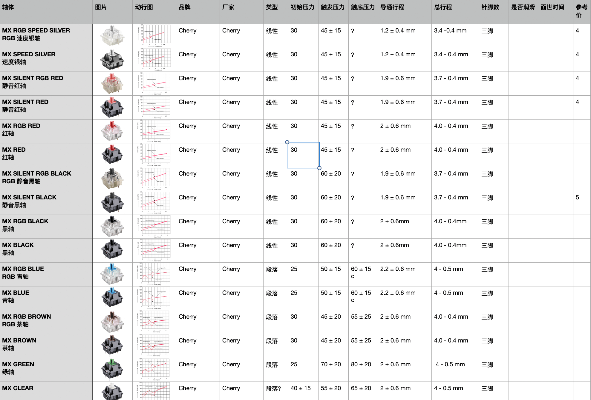

# 客制化键帽速查表 Custom Keycaps Quick Look

> 动动手，点一下**右上角**的Star🤝

如有遗漏，请联系QQ：448182355

## 更新历史见最底部

## 本速查表访问地址

1. [[客制化键帽速查表]](https://gitee.com/lisfanOSC/Custome-Keycaps#%E5%BF%AB%E9%80%9F%E5%AF%BC%E8%88%AA)：国内访问，左侧还有目录可供浏览
2. [[Custom Keycaps Quick Look]](https://lisfan.gitbook.io/custom-keycaps-quick-look/#kuai-su-dao-hang)：国外访问，右侧还有目录可供浏览

## 推广

## 快速导航

- qq交流群：722367843，QQ群做啥用途还不知道，进来的先占个坑再说吧
- [导读](./README.md)：推荐您在浏览前先阅读，每次的更新说明也会统一描述在这里
- [正在开团](./gb.md)：正在开团中的客制化键帽信息，团购结束后，再归类到各自系列
- [即将发车](./come.md)：近期发车的团购信息
- [IC 原厂高度](./ic.md)：正在IC中的客制化键帽信息
- [IC 其他高度](./ic-other.md)：正在IC中的客制化键帽信息
- [GMK 系列](./gmk.md) ：原厂高度
- [SP 系列](./sp.md)：SA高度，DSC高度，DSS高度，DSA高度
- [Matt3o 系列](./matt3o.md)：MT3高度
- [MELGEEK 系列](./melgeek.md)：MG高度，MDA高度
- [EnjoyPBT 系列](./enjoypbt.md)：原厂高度
- [JTK 系列](./jtk.md)：原厂高度，HSA高度
- [Geekark 文若 系列](./geekark.md)：【正在建设中】原厂高度，XDA高度，GTO高度
- [Keyreative（键设局） 系列](./keyreative.md)：KAT高度，KAM高度，原厂高度
- [MAXKEY 系列](./maxkey.md)：SA高度
- [DOMIKEY 系列](./domikey.md)：SA高度
- [Other 系列](./other.md)：不好归类的
- [客制化QQ群](./qq-group.md)：客制化QQ群集合，感谢 星陨 提供数据

## 建议新人入坑参考以下信息源

1. 本手册：本手册的设计定位在于**键帽速查**，能**快速**且**直观**的看到设计师灵感的大致面貌，访问者可以将本手册作为其他信息源的**互补**
   资料。
2. 若需要详细了解键帽具体的设计思想，可以通过点击每个**键帽名称**进入原IC地址。
3. 为了保留持续的热情，本文将主要维护以上几个品牌系列，非这些系列的将**不作主动收录**，**但开放表格由他人主动提交资料**，再由我来编辑
2. [Keycaps Info](https://matrixzj.github.io/) ：收录了gmk、sp品牌键帽信息
3. [zFrontier 键圈早报](https://www.zfrontier.com/app/user/3mdxPyXj8k9e)：（早上情报）聚合近期IC&开团等信息
4. [日·键圈时刻表](https://space.bilibili.com/57276677/article)：（晚上情报）聚合IC&开团等信息
4. [zFrontier - 情报专栏](https://www.zfrontier.com/app/circle/1#2007)：**国内**发布客制化相关IC信息
6. [KeyboardDaily](https://space.bilibili.com/436659663/article)：开团时刻表
7. [键帽交付进度](https://hackmd.io/_Ks8KFJNRNKSl0JvBExaEg#%E9%96%8B%E5%9C%98%E4%B8%AD)：汇总各个供应商的键帽更新进度
8. [无限号小团购列表](http://www.kbyu.top/)：鱼头专车，一般代购drop上的
9. [geekhack - IC](https://geekhack.org/index.php?board=132.0)：国外发布客制化相关IC信息
10. [geekhack - GB](https://geekhack.org/index.php?board=70.0)：国外发布客制化相关团购信息
11. [Reddit](https://www.reddit.com/r/mechmarket/new/)
12. [在线键盘配列编辑器](http://www.keyboard-layout-editor.com/)

## 打字测试网站

- https://monkeytype.com/
- https://typings.gg/
- https://typetest.io/
- https://barneyzhao.gitee.io/typing-cn/#/monkey
- https://typing.works/

## 后续更新计划

- jtk补充应该少一些的：hana,ps,水绿等，俄文三色
- 收录Infinikey、文若，Kate(Rama)、CannonCaps、OSA(Winmix)，无铭，akko（有直接售卖的键帽）
- 追加菜菜其他的字根热升华键帽到文章里
- 提供团长主动上报功能（附上xx字数的简介和高清大图） 团长还可以对自己的键帽介绍进行补充
- 收录hammer work
- 新功能拓展：增加色卡分类，通过色卡快速筛选
- 新功能拓展：增加设计师，开团时间数据数据
- 新功能拓展：分享该主题，支持画廊
- cdn 图片，图片可以设置精度节省流量
- 做到一定的流量后，去接入serverless，定制后台
- 不同的皮肤主题
- 接入百度统计
- 问题意见建议提交
- 共创一份轴体数据库（寻找大牛做知识共创，有意请联系：448182355）

### 待整理

### [GMK Pretty in Pink 增补](https://geekhack.org/index.php?topic=102307.0)

### DSA Hana Keyset (Available on SP keyshop)

https://geekhack.org/index.php?topic=74553.0
https://drop.com/buy/hana-dsa-custom-keycap-set?_ga=2.238811842.35918209.1615176744-2084176719.1607486142

Author Topic: [IC] IFK Dark Cyrillic - GB date is set, Oct 9-23, 2020!  (Read 17783 times)
https://geekhack.org/index.php?topic=107255.0

[IC] PBT musubi. 8/28/20 GB LIVE
https://geekhack.org/index.php?topic=106045.0

Author Topic: [GB] PBT Amalfi  (Read 8308 times)
https://geekhack.org/index.php?topic=108093.0

https://geekhack.org/index.php?topic=110564.0
Infinikey Marshmallow

Author Topic: [GB] IFK Blacklight Sep 10th - 25th  (Read 10091 times)

https://geekhack.org/index.php?topic=108557.0

https://geekhack.org/index.php?topic=95655.0
Author Topic: [GB] DSA Arcane & DSA Plague [canceled, 2nd try 2019]  (Read 10761 times)

## 更新历史

### 2021-04-12

- 信息变更
    - ePBT Psychedelic × Sweet girl：代工方从gmk改为epbt

- 开团时间确定
    - GMK Classic Arabic
    
- IC新增
    - GMK Shadow
    - GMK Fleuriste
    - DSA Historic
    - GMK Shiryō

### 2021-04-09

- 今日开团
  - GMK Agent 01

- 开团时间确定
  - GMK Shashin：2021.05.01
  - GMK Modern Japanese Desko： 调整为2021.04.19
  - GMK Moonlight： 2021.05.21
  - GMK ReForged：2021.09

- IC新增
  - GMK Rub Out
  - ePbt Wapuro

### 2021-04-08

- 开团时间确定
  - JTK Hanami：2021.05
  
### 2021-04-07

- 开团时间确定
  - SA Ramses：2021.04.16
  - ePBT Origami：2021.05.18
  - SP SA Spectra：2021.05.25
  - KAM Li'l Dragon：2021.06.01
  - GMK Vaporwave 蒸汽波 R2：2021.Q4
- IC新增
  - JTK Monke
  - GMK BLY
  - ePBT Infernal
  - GMK Brutalist
  - GMK Aegyptus
  - GMK Mercury
  - GMK Gunfight
  - KAT arbeit

### 2021-04-06

- 修复 epbt 图片丢失了
- 今日开团
  - GMK 原厂 Wasabi 山葵 V2
  - GMK 原厂 Boulder
  - SP DCS Delftware 蓝瓷
  - GMK 原厂 Blurple 蓝紫
  - GMK 原厂 METROPOLIS 大都会 R2
  - GMK 原厂 Fox 狐狸
  - SP SA Handarbeit+
- 开团时间更新
  - GMK Wise Wolf 改名 GMK Harvest
  - GMK Lychee 荔枝
  - GMK Trüffelschwein
- IC新增
  - GMK Alphabet
  - GMK Windowed
  - PBT The Big Screen
  - GMK PEDESTRIAN
  - GMK Diet Soda, MD
  - ePBT Basic Standard
  - GMK Redderish Alert
  - GMK Modern Ink
  - GMK Ube
  - GMK Blanks
  - GMK Windbreaker
  - GMK Psychedelic
  - GMK a

### 2021-04-01

- 今日开团
    - Melgeek MG Fishing 渔
    - DOMIKEY AVOSTAR 鳄梨星
    - SP X-mas Gift 圣诞礼物
    - PBT 原厂 Notion
    - SP SA Prism 棱镜
    - GMK 原厂 Monarch 君主
    - GMK 原厂 Hinokoku 火
    - PBT HIPRO EC （静电容专用）
- 截团下架：
    - DOMIKEY saber 亚瑟王
    - GMK Norse 诺斯
- 修正皇家海军图片错误

### 2021-03-31

- 移除akko的键帽收入
