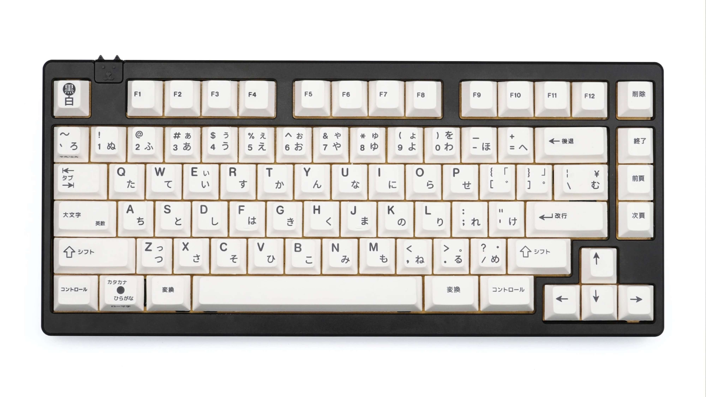

# 客制化键帽速查表 EnjoyPBT 篇

> 动动手，点一下**右上角**的Star🤝

如有遗漏，请联系QQ：448182355

## 快速导航

- qq交流群：722367843，QQ群做啥用途还不知道，进来的先占个坑再说吧
- [导读](./README.md)：推荐您在浏览前先阅读，每次的更新说明也会统一描述在这里
- [正在开团](./gb.md)：正在开团中的客制化键帽信息，团购结束后，再归类到各自系列
- [即将发车](./come.md)：近期发车的团购信息
- [IC 原厂高度](./ic.md)：正在IC中的客制化键帽信息
- [IC 其他高度](./ic-other.md)：正在IC中的客制化键帽信息
- [GMK 系列](./gmk.md) ：原厂高度
- [SP 系列](./sp.md)：SA高度，DSC高度，DSS高度，DSA高度
- [Matt3o 系列](./matt3o.md)：MT3高度
- [MELGEEK 系列](./melgeek.md)：MG高度，MDA高度
- [EnjoyPBT 系列](./enjoypbt.md)：原厂高度
- [JTK 系列](./jtk.md)：原厂高度，HSA高度
- [Geekark 文若 系列](./geekark.md)：【正在建设中】原厂高度，XDA高度，GTO高度
- [Keyreative（键设局） 系列](./keyreative.md)：KAT高度，KAM高度，原厂高度
- [MAXKEY 系列](./maxkey.md)：SA高度
- [DOMIKEY 系列](./domikey.md)：SA高度
- [Other 系列](./other.md)：不好归类的
- [客制化QQ群](./qq-group.md)：客制化QQ群集合，感谢 星陨 提供数据

## 说明

1. 名称前面带有`~`标记仅代表个人感兴趣🌝
2. **点图片上方的键帽名称**可以进入geekhack上的**IC**喔，没找到IC地址的我也尽可能的找到一个可替代的介绍
3. 部分图片来源于网络，若侵权请联系删除

## 键帽列表

### [ePBT 原厂 GRAND TOUR](https://geekhack.org/index.php?topic=108068.0)

- 设计师：fedemito
- 团购时间：2021.02.25 至 2021.03.26
- 发货时间：待定
- 购买方式：[KBDfans](https://kbdfans.store/products/TOUR/)

### [ePBT 原厂 WRAITH DARK](https://kbdfans.store/products/DP1463/)

- 设计师：BIIP
- 团购时间：2021.01.15 至 2021.03.15
- 发货时间：待定
- 购买方式：[KBDfans](https://kbdfans.store/products/DP1463/)

### [ePBT 原厂 Be the one](https://geekhack.org/index.php?topic=108119.0)

- 设计师：zekth
- 团购时间：2021.01.21 至 2021.02.28
- 发货时间：待定
- 购买方式：[KBDfans](https://kbdfans.store/products/Betheone/)

### [ePBT 原厂 SOJU](https://geekhack.org/index.php?topic=108887.0)

### [ePBT 原厂 RamenStop](https://geekhack.org/index.php?topic=108594.0)

### [~ePBT 原厂 KON MOMO 紺桃 黛粉](https://geekhack.org/index.php?topic=107280.0)

### [~ePBT 原厂 Ivory](https://geekhack.org/index.php?topic=106722)

### [ePBT 原厂 Extended 2048](https://geekhack.org/index.php?topic=99696.0)

### [~ePBT 原厂 SAMURAI 黑武士](https://kbdfans.com/collections/keycaps/products/samurai)

### [~ePBT 原厂 Heavy Industry 重工业](https://rama.works/pbt-heavy-industry)

### [~ePBT 原厂 Kuro/Shiro 黑/白](https://geekhack.org/index.php?topic=97699.0)

### [~ePBT 原厂 G81-SAV](https://geekhack.org/index.php?topic=102124.msg2805629)

### [ePBT 原厂 9009](https://kbdfans.store/products/C0015/)

### [~ePBT 原厂 PS](https://kbdfans.store/products/JM000565/)

### [ePBT 原厂 SKADI](https://geekhack.org/index.php?topic=109034.msg2978641)

### [ePBT 原厂 Royal Alpha 皇家打印机](https://kbdfans.com/collections/keycaps/products/ePBT-x-donutcat-royal-alpha-keycaps-set)

### [ePBT 原厂 Cool Kids](https://geekhack.org/index.php?topic=106670)

### [ePBT 原厂 SIMPLEJA](https://kbdfans.com/collections/keycaps/products/gb-enjoypbt-x-ai03-simpleja-pbt-keycaps-set)

### [~ePBT 原厂 红俄文](https://kbdfans.store/products/C0006/)

### [ePBT 原厂 橙俄文](https://kbdfans.store/products/C0008/)

### [ePBT 原厂 水绿](https://kbdfans.com/collections/keycaps/products/enjoypbt-abs-doubleshot-mechanical-keyboard-keycaps-set-3)

