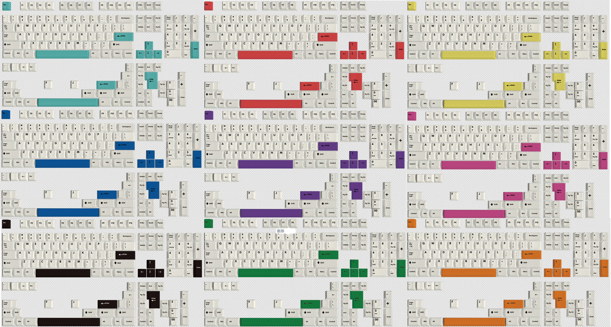
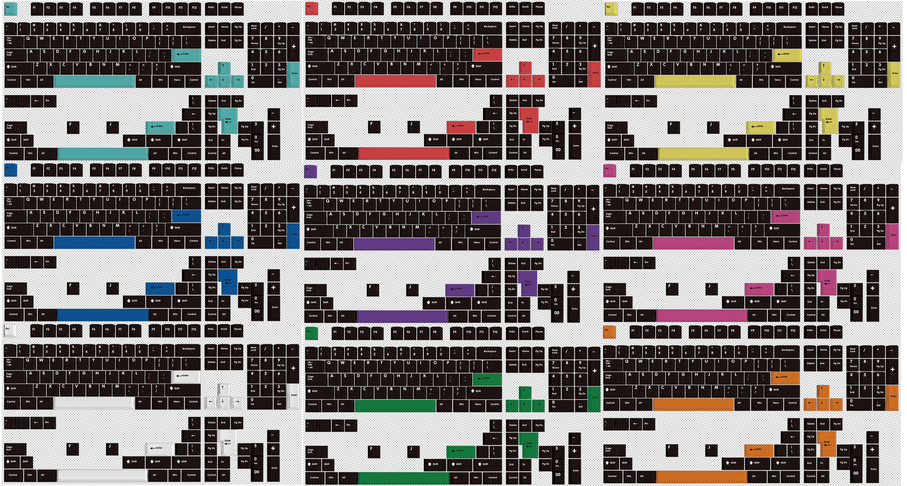

# 文若 BOW & WOB 彩色增补组合参考

## 快速导航

- [导读](./README.md)：推荐您在浏览前先阅读
- [正在开团](./gb.md)：正在开团中的客制化键帽信息，团购结束后，再归类到各自系列
- [即将发车](./come.md)：近期即将发车的团购信息
- [IC](./ic.md)：【正在建设中】正在IC中的客制化键帽信息
- [GMK 系列](./gmk.md) ：原厂高度
- [SP 系列](./sp.md)：SA高度，DSC高度
- [Matt3o 系列](./matt3o.md)：MT3高度
- [JTK 系列](./jtk.md)：原厂高度，HSA高度
- [EnjoyPBT 系列](./enjoypbt.md)：原厂高度
- [MELGEEK 系列](./melgeek.md)：MG高度，MDA高度
- [Keyreative（键设局） 系列](./keyreative.md)：KAT高度，KAM高度，原厂高度
- [MAXKEY 系列](./maxkey.md)：SA高度
- [DOMIKEY 系列](./domikey.md)：SA高度
- [AKKO 系列](./akko.md)：**（无铭的部分键帽和AKKO进行了合并）**，原厂高度，OEM高度，OSA高度，ASA高度
- [Other 系列](./other.md)：无法归类的

## 说明

1. 感谢 奈斯兰德 提供参考图
2. 点击图片可以查看大图喔，或者在图片上**右键**，**在新窗口中打开**图片喔
3. 由于平台大于1m需要登录显示的问题，特别提供了[高清源图供下载，请点击](https://pan.baidu.com/s/1KJ0dn7AFS37rmOVKMtnOtw)，提取码: dkr2

## 素白彩色增补组合参考图

## 素黑彩色增补组合参考图

