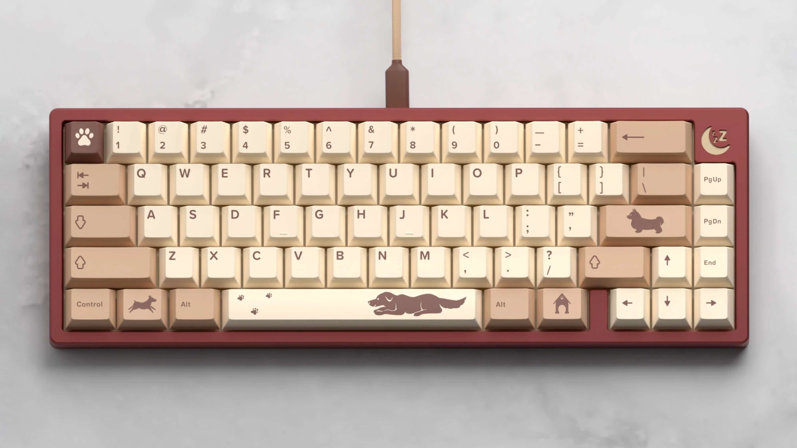

# 客制化键帽速查表 其他 篇

> 动动手，点一下**右上角**的Star🤝

如有遗漏，请联系QQ：448182355

更新内容：

- 2021-02-25 拆分到单个文档管理

## 快速导航

- [导读](./README.md)：推荐您在浏览前先阅读
- [正在开团](./gb.md)：正在开团中的客制化键帽信息，团购结束后，再归类到各自系列
- [即将发车](./come.md)：【正在建设中】近期即将发车的团购信息
- [IC](./ic.md)：【正在建设中】正在IC中的客制化键帽信息
- [GMK 系列](./gmk.md) ：原厂高度
- [SP 系列](./sp.md)：SA高度，DSC高度
- [Matt3o 系列](./matt3o.md)：MT3高度
- [MELGEEK 系列](./melgeek.md)：MG高度，MDA高度
- [EnjoyPBT 系列](./enjoypbt.md)：原厂高度
- [JTK 系列](./jtk.md)：原厂高度，HSA高度
- [Geekark 文若 系列](./geekark.md)：【正在建设中】原厂高度，XDA高度
- [Keyreative（键设局） 系列](./keyreative.md)：KAT高度，KAM高度，原厂高度
- [MAXKEY 系列](./maxkey.md)：SA高度
- [DOMIKEY 系列](./domikey.md)：SA高度
- [AKKO 系列](./akko.md)：**（无铭的部分键帽和AKKO进行了合并）**，原厂高度，OEM高度，OSA高度，ASA高度
- [Other 系列](./other.md)：无法归类的

## 说明

1. 名称前面带有`~`标记仅代表个人感兴趣🌝
2. **点图片上方的键帽名称**可以进入geekhack上的**IC**喔，没找到IC地址的我也尽可能的找到一个可替代的介绍
3. 部分图片来源于网络，若侵权请联系删除

## 键帽列表

### [Infinikey 原厂 Doggie](https://www.reddit.com/r/mechmarket/comments/l4uoid/ic_infinikey_doggie_keycap_set/)

- 设计师：Nhils
- 团购时间：2021.02.01 至 2021.02.28
- 发货时间：2021.07
- 购买方式：国内未代理

### [Keyreative KAT Slurp](https://geekhack.org/index.php?topic=108069)

- 设计师：Ulliam
- 团购时间：xxxx.xx.xx 至 xxxx.xx.xx
- 发货时间：xxxx.xx.xx
- 购买方式：zFrontier 待上，国外已开团

